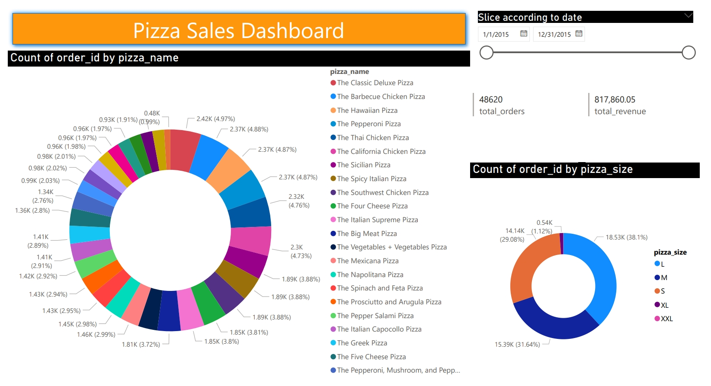

# Pizza Sales Dashboard

This repository contains a Power BI dashboard designed to analyze and visualize pizza sales data. The dashboard provides insights into sales performance, popular pizza types and sizes, and revenue trends over time. Below is a detailed breakdown of the dashboard's features:

## Features

1. **Most Popular Pizza Types**  
   - Orders are counted by `pizza_name` to identify the most frequently sold pizza type.

2. **Most Popular Pizza Sizes**  
   - Orders are counted by `pizza_size` to determine the most popular pizza size.

3. **Time-Sliced Sales Analysis**  
   - Sales data can be filtered by date, enabling users to select specific time intervals for analysis.

4. **Total Orders**  
   - The total number of orders is displayed to provide a quick overview of sales volume.

5. **Total Revenue**  
   - The total revenue is calculated and shown, giving insights into financial performance.

## Usage

- Clone the repository and open the Power BI dashboard file (`.pbix`) to explore the visuals.
- Use the slicer to filter the data by specific time intervals.
- View the most popular pizza types and sizes in the respective charts.
- Check the total order count and total revenue metrics for a comprehensive sales summary.

## Insights

This dashboard is a valuable tool for tracking pizza sales trends, understanding customer preferences, and making data-driven decisions to improve sales strategies.

---

### Example Visualization

## License

This project is licensed under the MIT License. See the [LICENSE](LICENSE) file for details.
